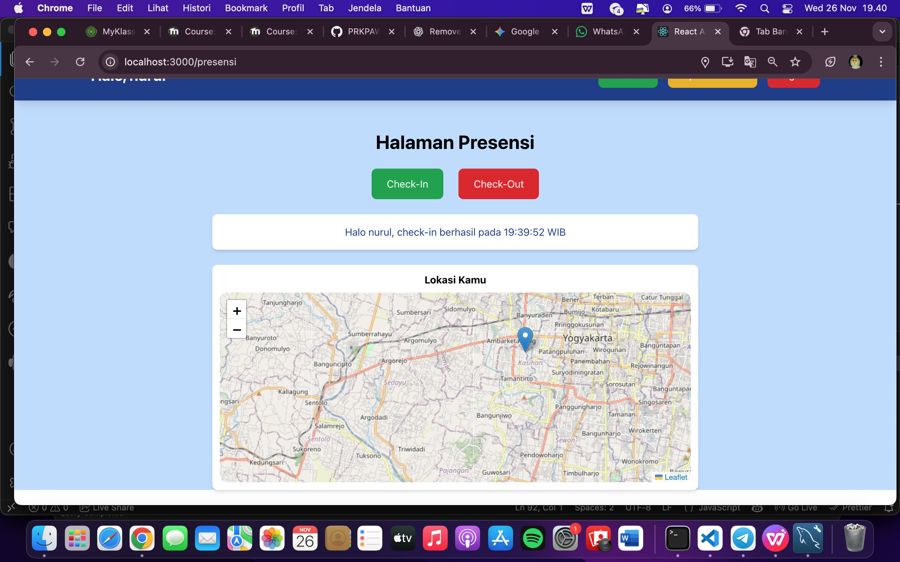
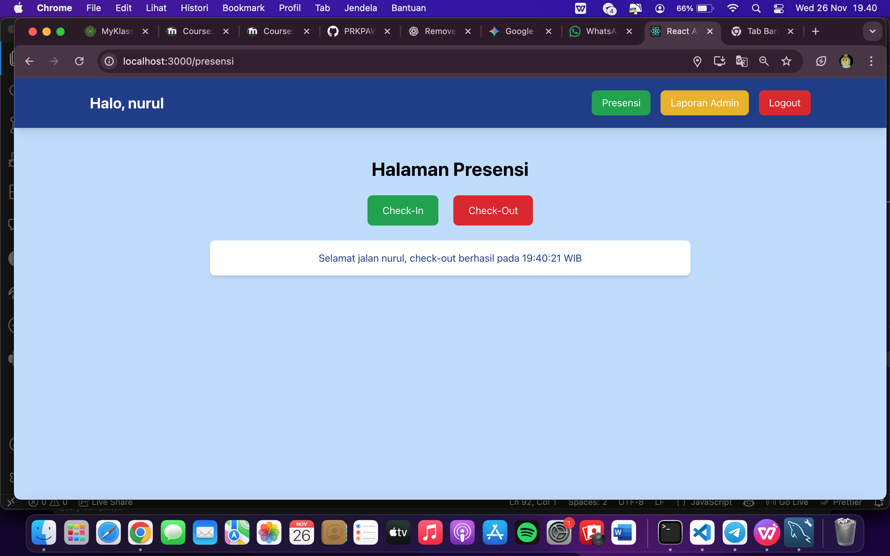
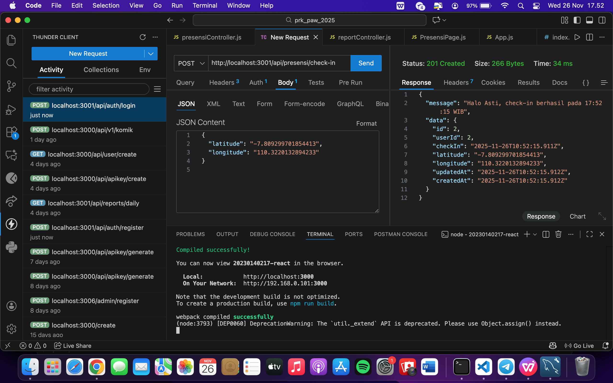
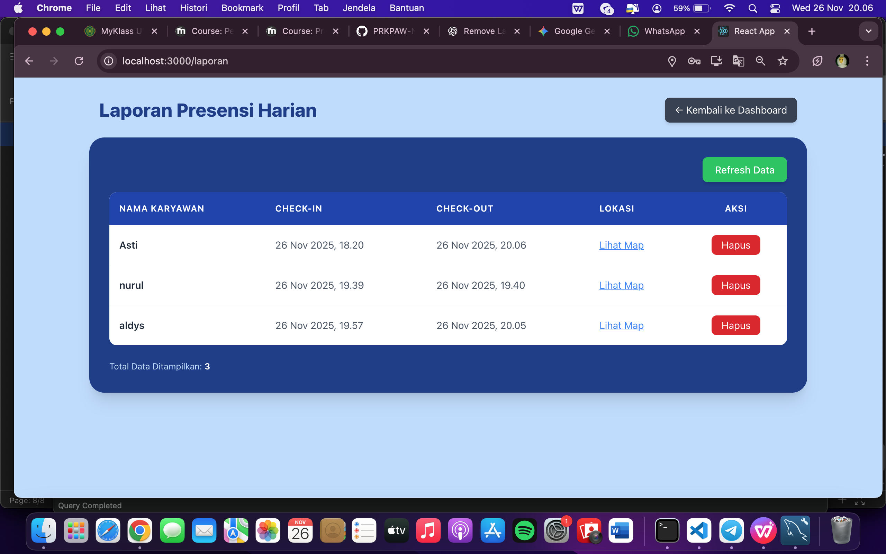

# Tampilan halaman presensi dengan menampilkan maps OSM bagian checkin

# Tampilan halaman presensi dengan menampilkan maps OSM bagian checkout

# Endpoint presensi/check-in dengan menggunakan bearer token dan body latitude, longitude.

# Tampilan halaman report yg berisi data presensi dari semua user

# Screenshote tabel presensi di database

