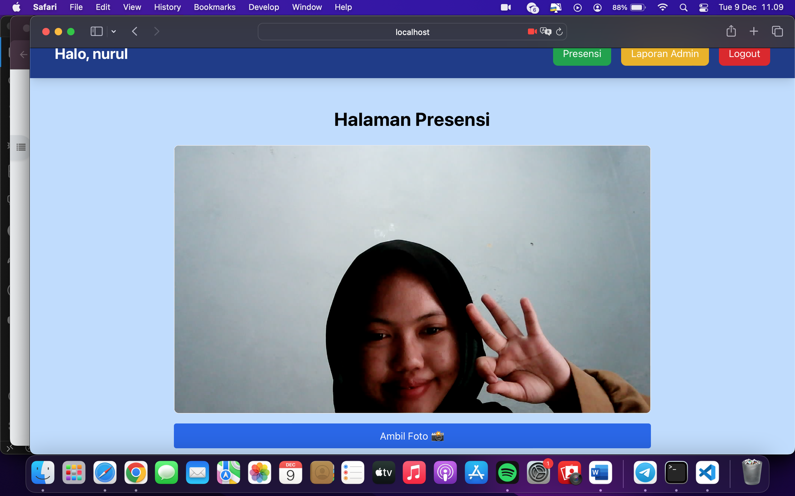
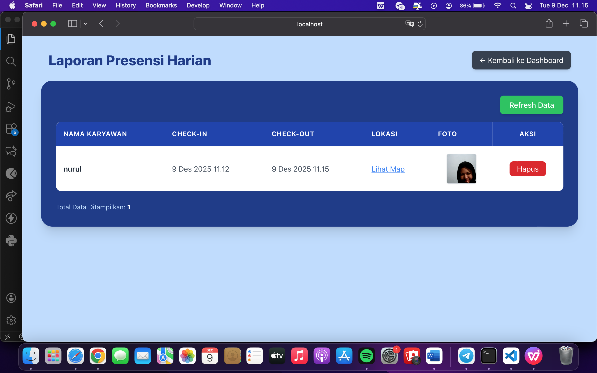
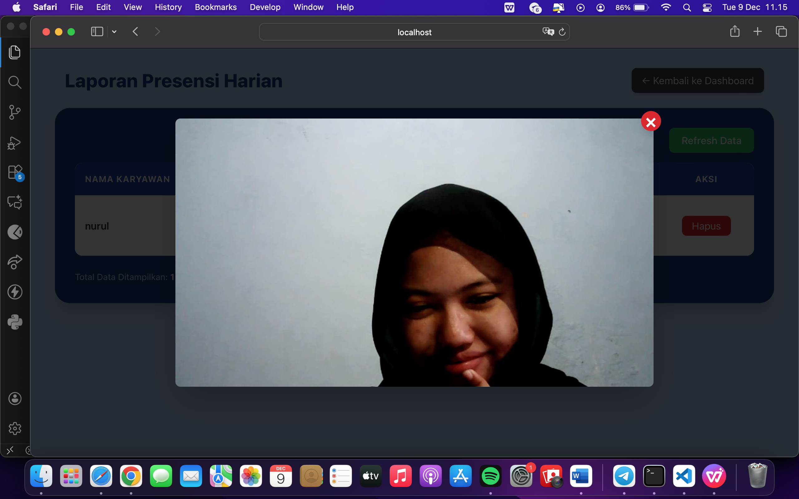
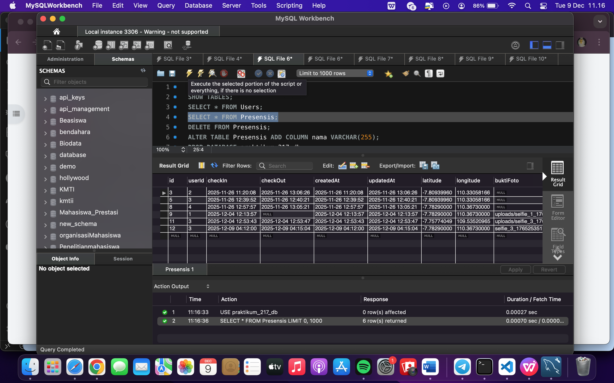

# PresensiPage yg menampilkan kamera

# Tambahkan kolom baru "Bukti Foto" di tabel reportpage.

# Tampilan thumbnail foto yang diambil dari URL (misal: http://localhost:3001/uploads/1-123456.jpg). Buat agar saat diklik, foto tampil ukuran penuh (modal/popup).

# Database Presensi

